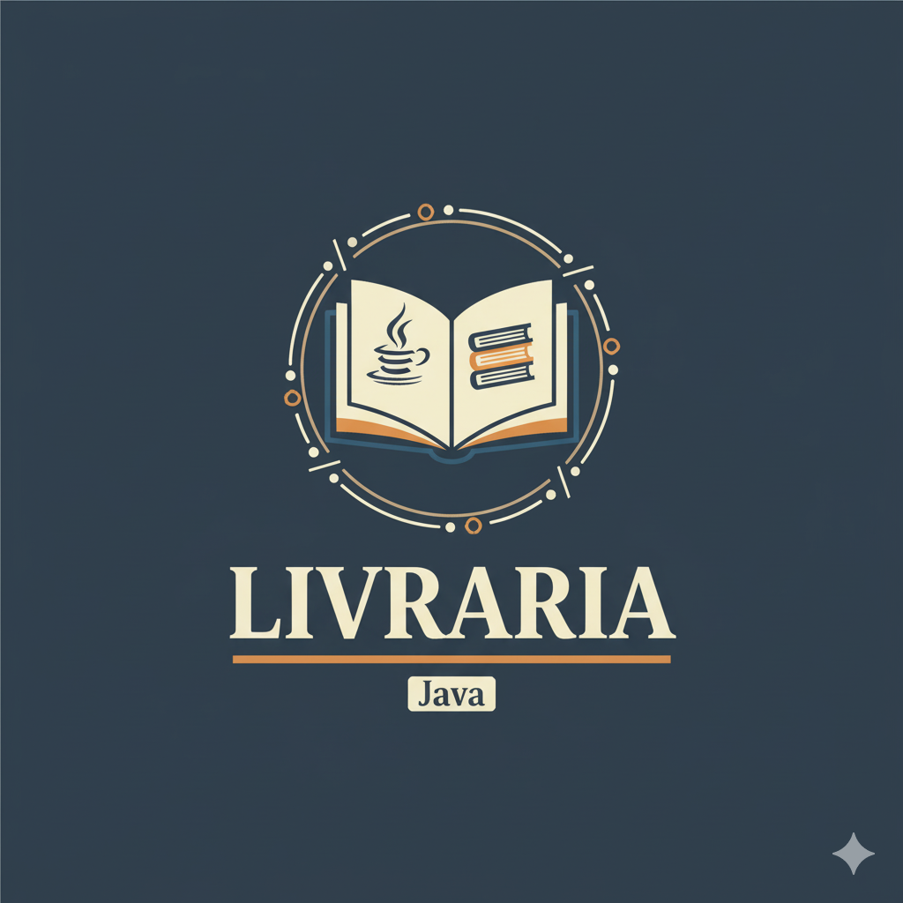

<p align="center">    </p>

# 📚 Livraria

(em andamento)

**Livraria** é um projeto desenvolvido em Java com o objetivo de simular o funcionamento de uma livraria. O sistema permite o cadastro de livros, clientes e realizações de vendas, proporcionando uma experiência prática para estudo de Programação Orientada a Objetos (POO).

---

## 🛠️ Funcionalidades

- **Cadastro de Livros**: Adicionar informações como título, autor, preço e estoque.
- **Cadastro de Clientes**: Registrar dados dos clientes para facilitar o processo de compra.
- **Realização de Vendas**: Processar compras, atualizando estoque e gerando registros de transações.
- **Relatórios**: Gerar relatórios de vendas e estoque para análise gerencial.

---

## 📂 Estrutura do Projeto

Livraria/
<br>
├── src/ # Código-fonte Java
<br>
│ ├── Livro.java # Classe Livro
<br>
│ ├── Cliente.java # Classe Cliente
<br>
│ ├── Venda.java # Classe Venda
<br>
│ └── Main.java # Classe principal para execução
<br>
├── .gitignore # Arquivos/pastas ignorados pelo Git
<br>
└── README.md # Este arquivo


---

## 🚀 Como Executar

1. Clone este repositório:
   ```bash
   git clone https://github.com/Gabrielli-Rech/Livraria.git


2. Navegue até a pasta do projeto:

cd Livraria


3. Compile e execute o projeto:

javac src/*.java
java src.Main


Ou utilize sua IDE favorita para compilar e executar o projeto.

🧪 Tecnologias Utilizadas

Linguagem: Java

Paradigma: Programação Orientada a Objetos (POO)

📄 Licença

Este projeto está licenciado sob a licença MIT. Sinta-se à vontade para utilizar, modificar e distribuir o código conforme necessário.
